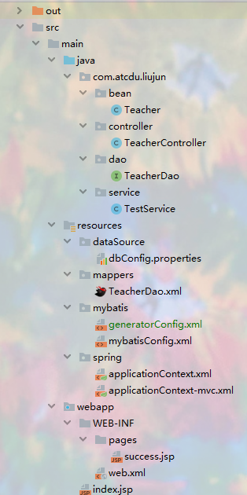

# ssm框架整合

## 一项目结构  
  
  
## spring配置  

- 1.在web.xml中添加对spring的配置  

```xml
<context-param>
        <param-name>contextConfigLocation</param-name>
        <param-value>classpath:spring/applicationContext.xml</param-value>
    </context-param>

<listener>
        <listener-class>org.springframework.web.context.ContextLoaderListener</listener-class>
    </listener>
```
初始化spring容器  
-  2.applicationContext.xml配置spring相关  
```xml
<!--包扫描，排除controller层-->
    <context:component-scan base-package="com.atcdu.liujun">
        <context:exclude-filter type="annotation" expression="org.springframework.stereotype.Controller"/>
    </context:component-scan>
```    
spring只负责controller层之外的主键的扫描  

```xml
<!--配置数据源-->
        <!-- 引入外部配置文件-->
        <context:property-placeholder location="classpath:dataSource/dbConfig.properties"></context:property-placeholder>
    <bean id="dataSource" class="com.mchange.v2.c3p0.ComboPooledDataSource">
        <property name="user" value="${jdbc.user}"></property>
        <property name="password" value="${jdbc.password}"></property>
        <property name="jdbcUrl" value="${jdbc.jdbcUrl}"></property>
        <property name="driverClass" value="${jdbc.driverClass}"></property>
    </bean>
<!--配置事务控制(配置事务控制器，让它管理数据源里面的提交和关闭)-->
    <bean id="TxManager" class="org.springframework.jdbc.datasource.DataSourceTransactionManager">
        <property name="dataSource" ref="dataSource"></property>
    </bean>
    <!--配置事务,那些方法要切入事务，配置事务方法表达式-->
    <aop:config>
        <aop:pointcut id="txPoint" expression="execution(* com.atcdu.liujun.service.* .*(..))"/>
        <aop:advisor advice-ref="myTx" pointcut-ref="txPoint"></aop:advisor>
    </aop:config>
    <!--最重要的是idea中自动导入的tx名称空间是错的，
    手动改为：xmlns:tx="http://www.springframework.org/schema/tx"       -->

    <!--具体的对那个切入点方法的事务的控制-->
    <tx:advice id="myTx" transaction-manager="TxManager">
        <tx:attributes>
            <tx:method name="*" rollback-for="java.lang.Exception"/>
<!--            <tx:method name="get*" read-only="true"></tx:method>-->
<!--            <tx:method name="insert*" isolation="REPEATABLE_READ"></tx:method>-->
        </tx:attributes>
    </tx:advice>
    <!--整合mybatis   配置mybatis的sqlsessionfactorybean-->
    <bean id="sqlSessionFactoryBean" class="org.mybatis.spring.SqlSessionFactoryBean">
        <property name="configLocation" value="classpath:mybatis/mybatisConfig.xml"></property>
        <property name="dataSource" ref="dataSource"></property>
        <property name="mapperLocations" value="classpath:mappers/*.xml"></property>
    </bean>
    <!--把dao接口注入到ioc中-->
    <bean class="org.mybatis.spring.mapper.MapperScannerConfigurer">
        <property name="basePackage" value="com.atcdu.liujun.dao"></property>
    </bean>

```    

这里spring主要做的事情是  
- 1.配置数据源，从外部加载
- 2.配置事务控制器，方便事务管理,事务控制器需要控住数据源
（事务控制器类似aop编程时的想要切入的那一方，需要加载到spring容器中）
- 3.配置事务,那些方法要切入事务，写好切入点表达式，
这里的事务aop不像普通的aop，需要用<aop:advice>
- 4.配置与mybatis的整合，配置mybayis需要的sqlsessionfactorybean，并且在其中添加
数据源，mybatis的全局配置文件，mapper文件的扫描
- 5.最后需要把mapper文件对应的接口也扫描到ioc中，使用MapperScannerConfigurer
## springmvc配置  
- 1.在web.xml中添加
```xml
<filter>
        <filter-name>CharacterEncodingFilter</filter-name>
        <filter-class>org.springframework.web.filter.CharacterEncodingFilter</filter-class>
        <init-param>
            <param-name>encoding</param-name>
            <param-value>utf-8</param-value>
        </init-param>
        <init-param>
            <param-name>forceEncoding</param-name>
            <param-value>true</param-value>
        </init-param>
    </filter>
    <filter>
        <filter-name>rest</filter-name>
        <filter-class>org.springframework.web.filter.HiddenHttpMethodFilter</filter-class>
    </filter>
    <filter-mapping>
        <filter-name>CharacterEncodingFilter</filter-name>
        <url-pattern>/*</url-pattern>
    </filter-mapping>
    <filter-mapping>
        <filter-name>rest</filter-name>
        <url-pattern>/*</url-pattern>
    </filter-mapping>
以上分别是编码过滤器和支持restful风格的过滤器


<servlet>
        <servlet-name>SpringMvcDispatcherServlet</servlet-name>
        <servlet-class>org.springframework.web.servlet.DispatcherServlet</servlet-class>
        <init-param>
            <param-name>contextConfigLocation</param-name>
            <param-value>classpath:spring/applicationContext-mvc.xml</param-value>
        </init-param>
    </servlet>
    <servlet-mapping>
        <servlet-name>SpringMvcDispatcherServlet</servlet-name>
        <url-pattern>/</url-pattern>
    </servlet-mapping>
SpringMvc配置springmvc实则配置为servlet
```

- 2.springmvc配置文件   
 ```xml
 <!--springmvc只扫描控制器（controller）,禁用默认规则-->
    <context:component-scan base-package="com.atcdu.liujun" use-default-filters="false">
        <context:include-filter type="annotation" expression="org.springframework.stereotype.Controller"/>
    </context:component-scan>
    <!--视图解析器-->
    <bean class="org.springframework.web.servlet.view.InternalResourceViewResolver">
        <property name="prefix" value="/WEB-INF/pages/"></property>
        <property name="suffix" value=".jsp"></property>
    </bean>

    <!--文件上传解析器-->
    <bean id="multipartResolver" class="org.springframework.web.multipart.commons.CommonsMultipartResolver">
        <property name="defaultEncoding" value="utf-8"></property>
        <property name="maxUploadSize" value="#{1024*1024*10}"></property>
    </bean>
    <!--扫描静态资源-->
    <mvc:default-servlet-handler></mvc:default-servlet-handler>
    <!--扫描动态资源-->
    <mvc:annotation-driven></mvc:annotation-driven>
```
这里比较简单，只是配置了，扫描controller层，视图解析器，之类的